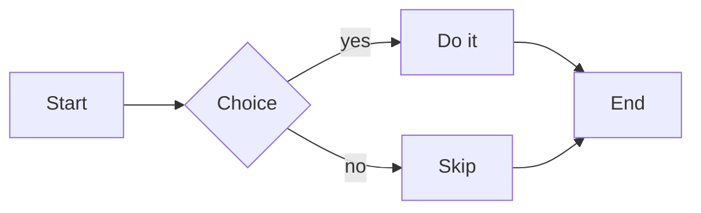
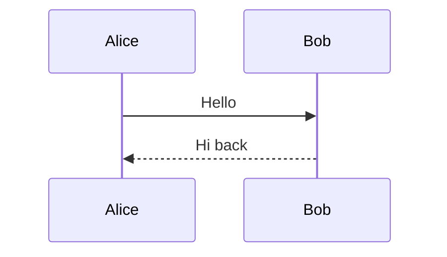
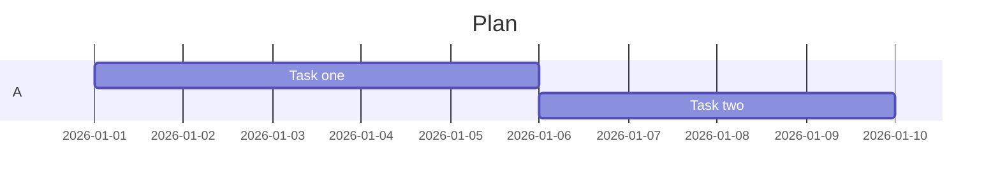
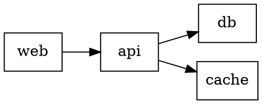

# Diagrams

## Mermaid flowchart

```mermaid
flowchart LR
    A[Start] --> B{Choice}
    B -->|yes| C[Do it]
    B -->|no| D[Skip]
    C --> E[End]
    D --> E
```

## Mermaid sequence

```mermaid
sequenceDiagram
    Alice->>Bob: Hello
    Bob-->>Alice: Hi back
```

## Mermaid gantt

```mermaid
gantt
    title Plan
    dateFormat YYYY-MM-DD
    section A
    Task one :a1, 2026-01-01, 5d
    Task two :after a1, 4d
```

## Graphviz

```dot
digraph G {
  rankdir=LR
  node [shape=box]
  web -> api -> db
  api -> cache
}
```
