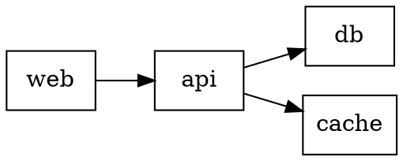
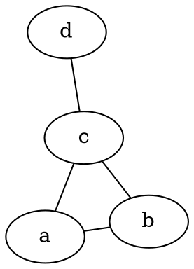

# Graphviz

Fences labelled `dot` or `graphviz` both work.

```dot
digraph G {
  rankdir=LR
  node [shape=box]
  web -> api -> db
  api -> cache
}
```

```graphviz
graph {
  layout=neato
  a -- b -- c -- a
  c -- d
}
```
