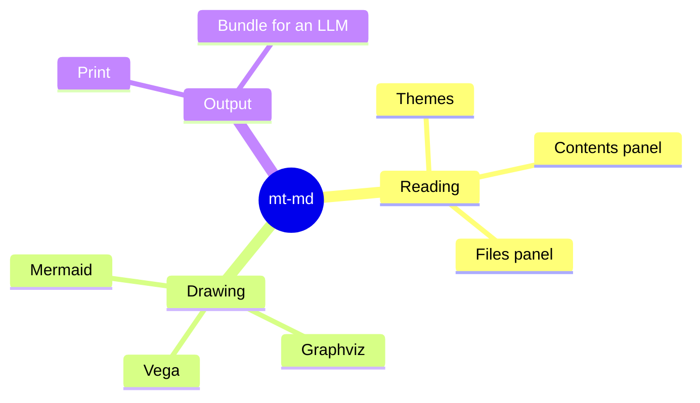
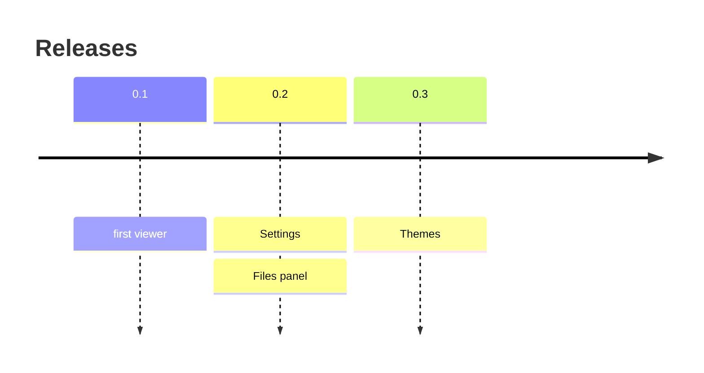

# Mind maps

A mind map is a Mermaid diagram, so it follows the theme like the rest.

```mermaid
mindmap
  root((mt-md))
    Reading
      Themes
      Contents panel
      Files panel
    Drawing
      Mermaid
      Graphviz
      Vega
    Output
      Print
      Bundle for an LLM
```

## Timeline

```mermaid
timeline
    title Releases
    0.1 : first viewer
    0.2 : Settings : Files panel
    0.3 : Themes
```
