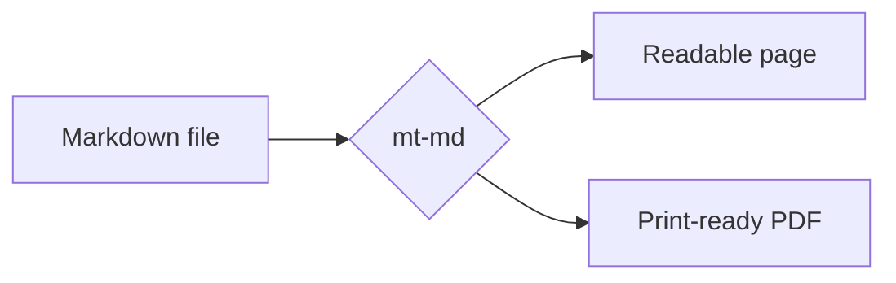
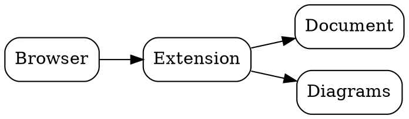
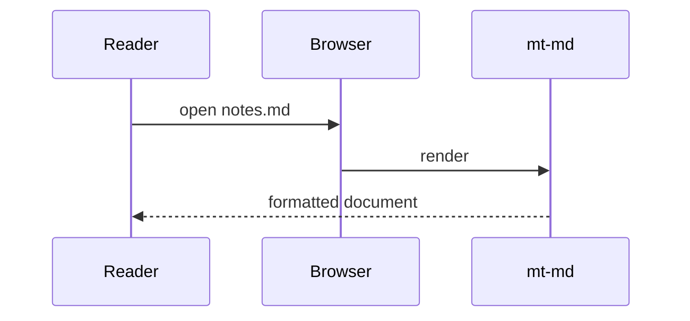

# Diagrams as code

Mermaid and Graphviz fences become inline vector diagrams.

```mermaid
flowchart LR
    A[Markdown file] --> B{mt-md}
    B --> C[Readable page]
    B --> D[Print-ready PDF]
```

```dot
digraph G {
  rankdir=LR;
  node [shape=box, style=rounded];
  Browser -> Extension -> Document;
  Extension -> Diagrams;
}
```

```mermaid
sequenceDiagram
    Reader->>Browser: open notes.md
    Browser->>mt-md: render
    mt-md-->>Reader: formatted document
```
